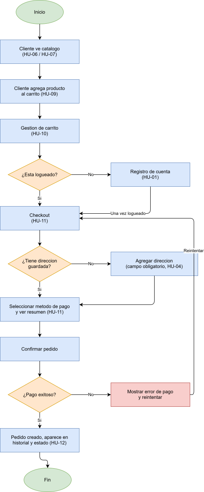
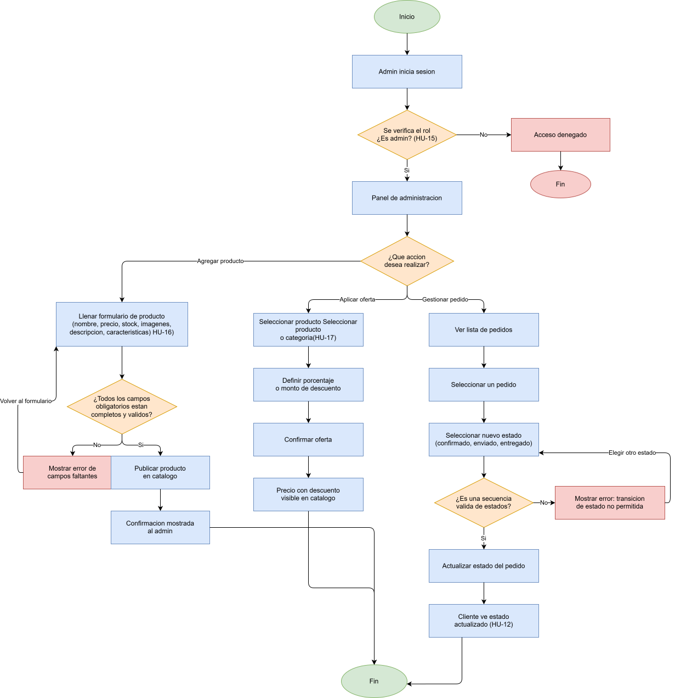

# Flujos — next-shopping

## Flujo de Compra (Cliente)

Cubre el proceso completo desde que el cliente ve el catálogo hasta que su pedido queda registrado en el historial.

## Flujo de Administración (Admin)

Cubre la verificación de acceso y las 3 acciones principales del admin: agregar producto, aplicar ofertas y gestionar pedidos.

