# Wireframes — next-shopping

Bocetos de baja fidelidad que validan la estructura y ubicación de los elementos en cada pantalla, antes de definir estilos visuales (ver `05-ui-ux.md`).

---

## Cliente

### Home

**Móvil**
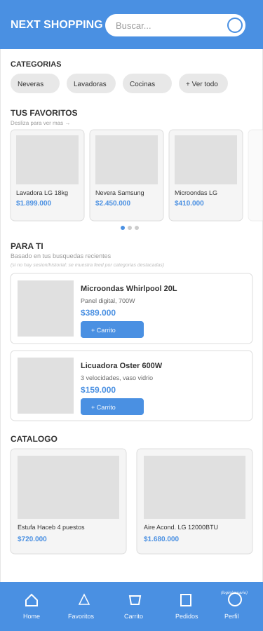

Header fijo (logo + buscador), navbar inferior fijo (Home, Favoritos, Carrito, Pedidos, Perfil). Body scrolleable con: categorías (chips horizontales), favoritos (carrusel), feed personalizado "Para ti" (HU-13), catálogo general.

**Desktop**
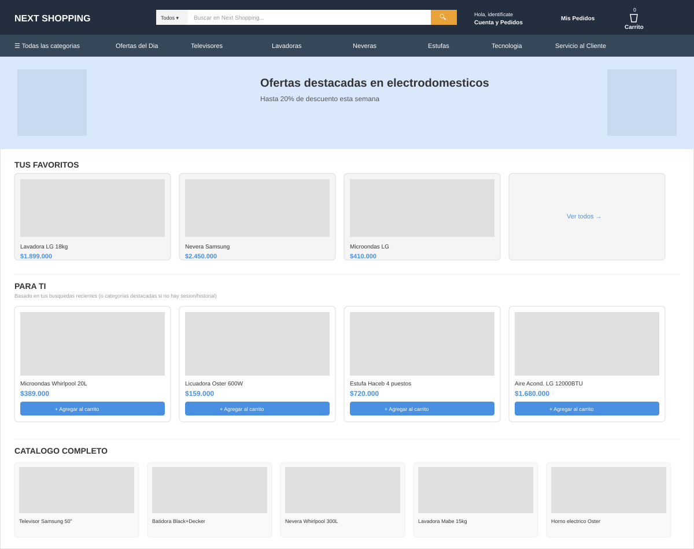

Header en 2 niveles (cuenta, pedidos, carrito arriba; categorías principales abajo, sin sidebar fijo). Contenido a todo el ancho: favoritos y feed personalizado en grid de 4 columnas.

---

### Detalle de producto

**Móvil**
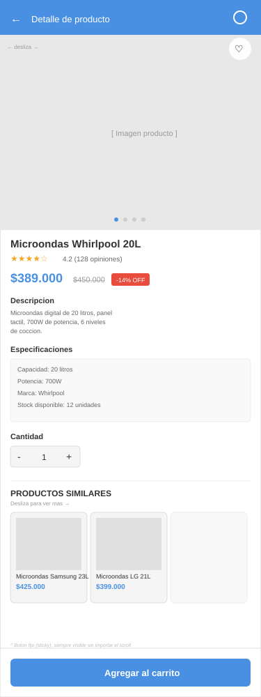

Carrusel de imágenes deslizable, rating removido (fuera de alcance), botón "Agregar al carrito" sticky (fijo abajo). Incluye sección de productos similares (HU-19) como carrusel horizontal.

**Desktop**
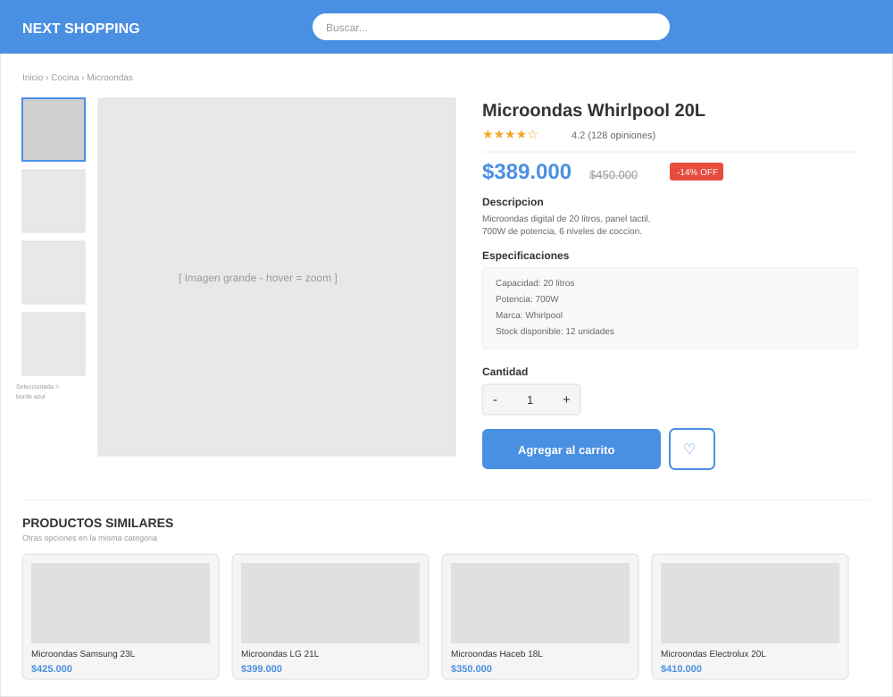

Miniaturas verticales a la izquierda de la imagen principal (hover = zoom), información y botón de compra a la derecha (no sticky, ya visible sin scroll). Productos similares como grid de 4 tarjetas al final.

---

### Carrito de compras

**Móvil**
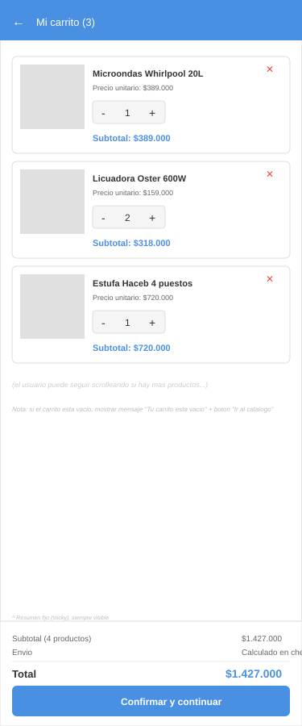

Lista de productos con controles `-`/`+` de cantidad, resumen de total sticky (fijo abajo) con botón "Confirmar y continuar".

**Desktop**
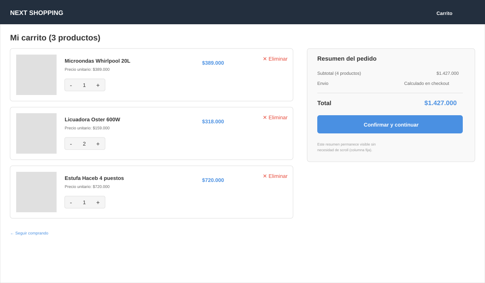

Layout de 2 columnas: lista de productos a la izquierda, resumen fijo (no sticky, ya visible) a la derecha.

---

### Checkout

**Móvil**
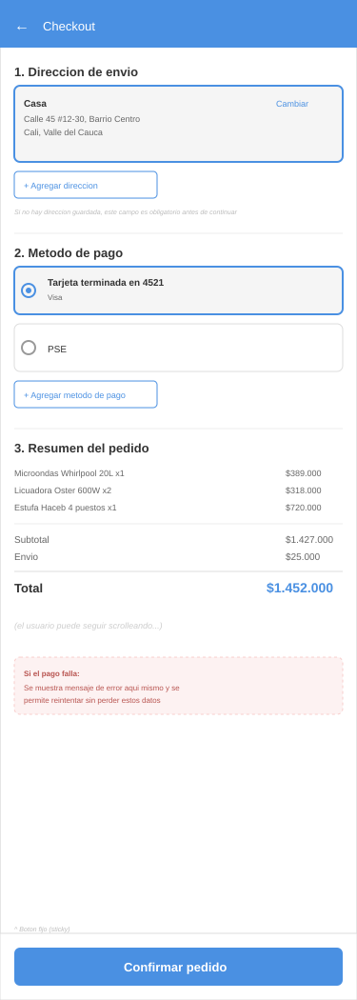

Orden: Dirección → Método de pago → Resumen del pedido. Botón "Confirmar pedido" sticky. Incluye referencia visual del manejo de error de pago (HU-11).

**Desktop**
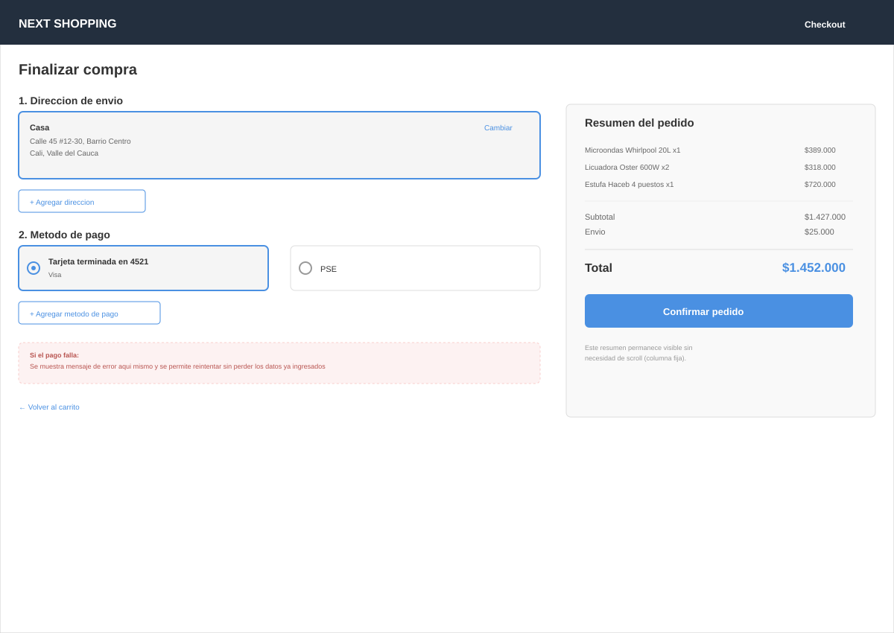

Mismo layout de 2 columnas que el carrito: formularios a la izquierda, resumen fijo a la derecha.

---

### Historial de pedidos

**Móvil**
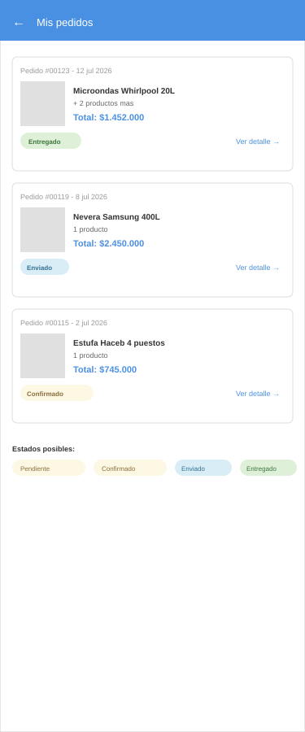
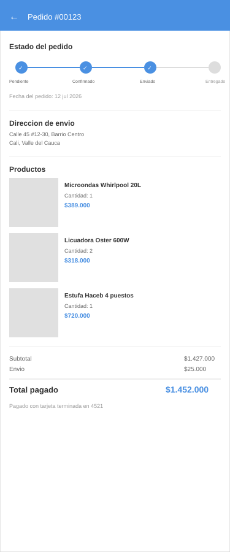

Lista en tarjetas apiladas con badge de estado. El detalle incluye línea de tiempo visual del estado del pedido (Pendiente → Confirmado → Enviado → Entregado).

**Desktop**
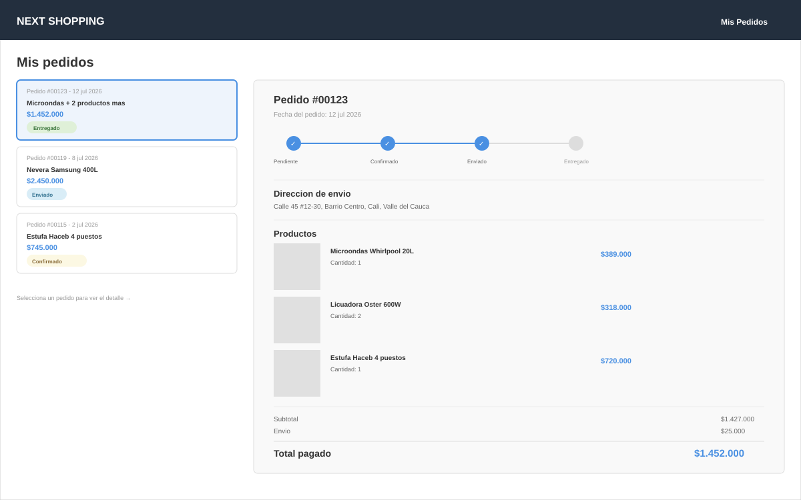

Patrón maestro-detalle: lista angosta a la izquierda, detalle del pedido seleccionado expandido a la derecha (sin necesidad de navegar a otra pantalla).

---

## Administración

*(Solo desktop — los administradores operan desde computador)*

### Agregar producto
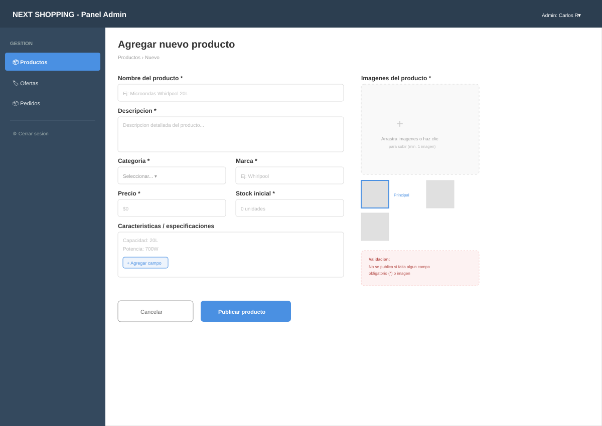

Sidebar de navegación admin (Productos, Ofertas, Pedidos). Formulario con campos obligatorios marcados (*), zona de carga de imágenes con selección de imagen principal, nota de validación (HU-16).

### Gestión de ofertas
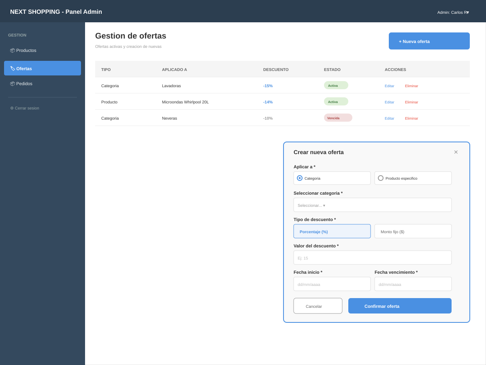

Tabla de ofertas activas con estado (Activa/Vencida). Panel de creación con selección de producto o categoría, tipo de descuento (%/monto fijo), y fechas de inicio/vencimiento (HU-17).

### Gestión de pedidos
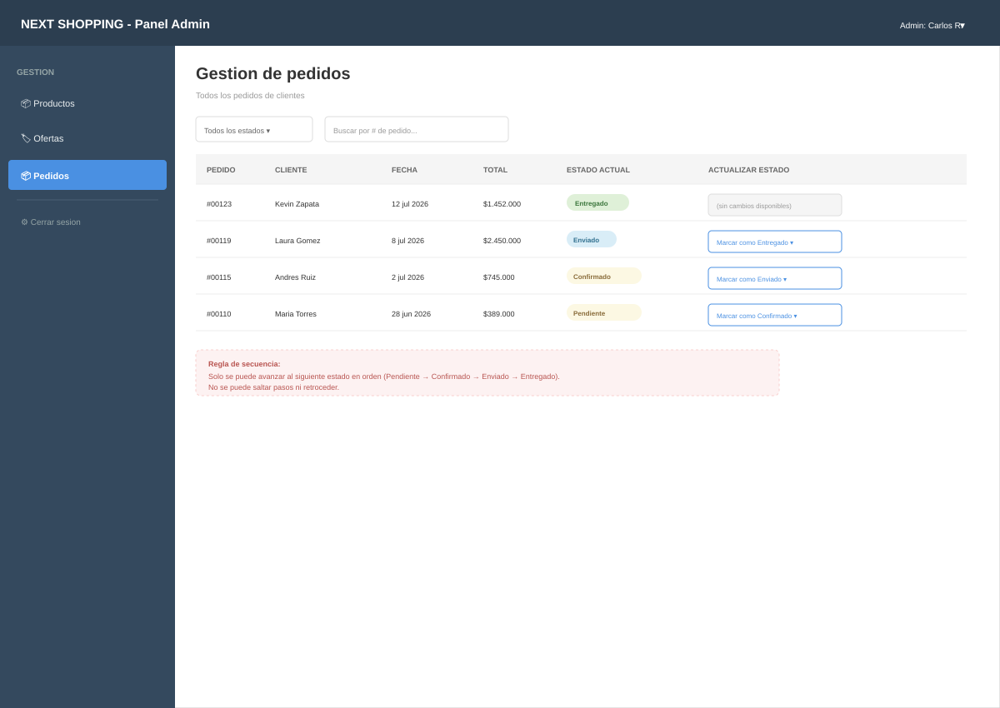

Tabla de pedidos con filtros por estado. El botón de actualización solo ofrece el siguiente estado válido en la secuencia, evitando saltos incorrectos (HU-18).

---

## Resumen

| Pantalla | Móvil | Desktop |
|----------|:-----:|:-------:|
| Home | ✅ | ✅ |
| Detalle de producto | ✅ | ✅ |
| Carrito | ✅ | ✅ |
| Checkout | ✅ | ✅ |
| Historial de pedidos | ✅ | ✅ |
| Admin - Agregar producto | — | ✅ |
| Admin - Ofertas | — | ✅ |
| Admin - Pedidos | — | ✅ |

**Total: 14 wireframes**