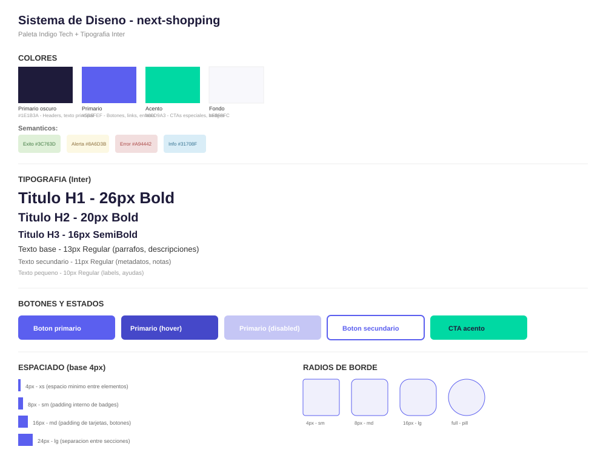
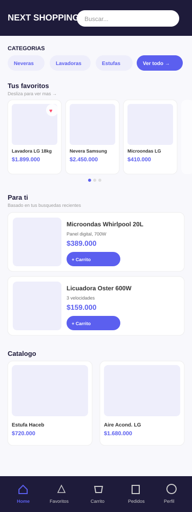
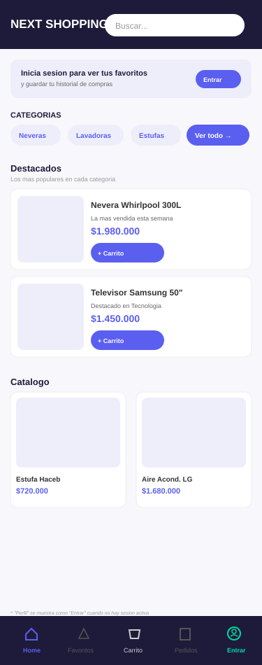

# UI/UX — next-shopping

## Sistema de diseño

### Paleta de colores

Se eligió la paleta **Indigo Tech**, transmite una sensación moderna y tecnológica, alineada con el perfil de next-shopping como ecommerce de electrodomésticos y tecnología.

| Color | Hex | Uso |
|-------|-----|-----|
| Primario oscuro | `#1E1B3A` | Headers, navbar, texto principal |
| Primario | `#5B5FEF` | Botones, links, elementos de énfasis |
| Acento | `#00D9A3` | CTAs especiales, badges destacados |
| Fondo | `#F8F8FC` | Fondo general de la app |

**Colores semánticos:**

| Color | Hex | Uso |
|-------|-----|-----|
| Éxito | `#3C763D` | Confirmaciones, estado "Entregado" |
| Alerta | `#8A6D3B` | Estados "Pendiente", "Confirmado" |
| Error | `#A94442` | Errores, pago fallido, oferta vencida |
| Info | `#31708F` | Estado "Enviado" |

---

### Tipografía

Fuente: **Inter** (Google Fonts) — elegida por su legibilidad en pantalla y versatilidad en distintos pesos.

| Estilo | Tamaño | Peso | Uso |
|--------|--------|------|-----|
| H1 | 26px | Bold | Títulos de página |
| H2 | 20px | Bold | Títulos de sección |
| H3 | 16px | SemiBold | Subtítulos, nombres de producto |
| Texto base | 13px | Regular | Párrafos, descripciones |
| Texto secundario | 11px | Regular | Metadatos, notas |
| Texto pequeño | 10px | Regular | Labels, ayudas |

---

### Espaciado

Sistema basado en múltiplos de 4px (compatible con clases de Tailwind):

| Token | Valor | Uso |
|-------|-------|-----|
| xs | 4px | Espacio mínimo entre elementos |
| sm | 8px | Padding interno de badges |
| md | 16px | Padding de tarjetas y botones |
| lg | 24px | Separación entre secciones |

---

### Radios de borde

| Token | Valor | Uso |
|-------|-------|-----|
| sm | 4px | Inputs, badges pequeños |
| md | 8px | Tarjetas de producto |
| lg | 16px | Modales, paneles destacados |
| full | 9999px | Botones tipo "pill", chips de categoría |

---

### Botones y estados

- **Primario:** fondo `#5B5FEF`, texto blanco — acción principal de cada pantalla
- **Primario (hover):** fondo `#4548C9`
- **Primario (disabled):** fondo `#C5C6F5`
- **Secundario:** fondo blanco, borde `#5B5FEF` — acciones alternativas (ej: "Cancelar")
- **CTA acento:** fondo `#00D9A3` — usado en casos especiales (ofertas, promociones)

---

## Mockups de alta fidelidad

Aplicación del sistema de diseño sobre los wireframes ya validados (ver `04-wireframes.md`). Se documenta el home como ejemplo de referencia; el resto de pantallas seguirán el mismo sistema de diseño al momento de programarlas.

### Home (móvil) - Con sesión activa

Wireframe de referencia: [wireframe-home-movil](./assets/wireframes/wireframe-home-movil.svg)

### Home (móvil) - Sin sesión activa

Muestra el estado por defecto cuando no hay usuario logueado: sin sección de favoritos, feed de "Destacados" en vez de personalizado (ver criterios de aceptación de HU-13 y HU-14), y banner de invitación a iniciar sesión.