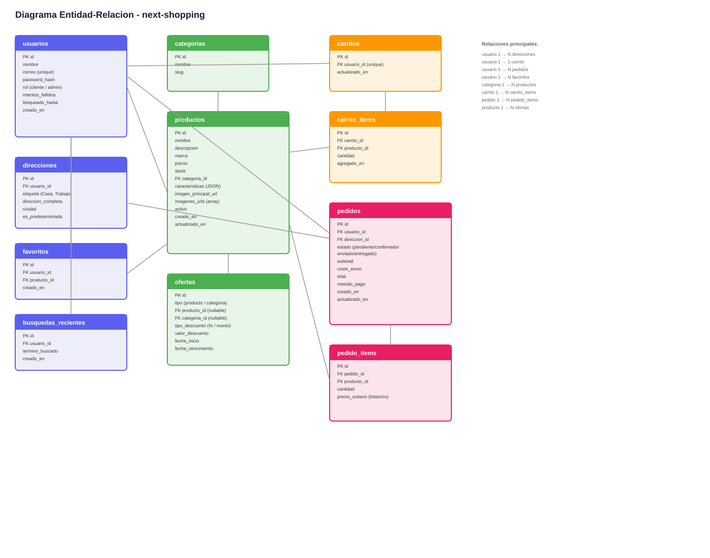

# Base de datos — next-shopping

PostgreSQL alojado en Supabase, gestionado mediante Prisma ORM. El schema completo vive en `backend/prisma/schema.prisma`.

## Diagrama entidad-relación

---

## Tablas

### users
Clientes y administradores (HU-01, HU-15). El campo `role` distingue `CUSTOMER` de `ADMIN`.

| Campo | Tipo | Notas |
|---|---|---|
| id | uuid | PK |
| email | string | único |
| password | string | hash bcrypt (RNF-04) |
| firstName, lastName | string | |
| phone | string? | opcional |
| role | enum | CUSTOMER / ADMIN |
| failedLoginAttempts | int | control de bloqueo (RNF-05) |
| lockedUntil | datetime? | bloqueo temporal tras 5 intentos fallidos |

### addresses
Direcciones de envío del usuario (HU-04). Relación 1 a N con `users`.

| Campo | Tipo | Notas |
|---|---|---|
| id | uuid | PK |
| userId | uuid | FK → users |
| label | string | "Casa", "Trabajo" |
| street, city, state, country | string | |
| isDefault | boolean | dirección predeterminada al hacer checkout |

### categories
Categorías **planas** (sin subcategorías — decisión de alcance).

| Campo | Tipo | Notas |
|---|---|---|
| id | uuid | PK |
| name, slug | string | únicos |
| description | string? | |
| imageUrl | string? | |
| isActive | boolean | |

### products
Catálogo de productos (HU-06, HU-07, HU-16). Tabla central del sistema.

| Campo | Tipo | Notas |
|---|---|---|
| id | uuid | PK |
| name, slug, description | string | |
| price | decimal(10,2) | nunca float, evita errores de redondeo |
| stock | int | |
| brand | string? | |
| categoryId | uuid | FK → categories |
| specs | json | características dinámicas del formulario admin |
| isActive, isFeatured | boolean | |
| viewCount, salesCount | int | métricas; `salesCount` usado en el feed por defecto (RF-17) |

### product_images
Imágenes de producto (Cloudinary), separadas en su propia tabla.

| Campo | Tipo | Notas |
|---|---|---|
| id | uuid | PK |
| productId | uuid | FK → products |
| url | string | URL de Cloudinary |
| position | int | 0 = imagen principal |

### discounts (ofertas)
HU-17. Aplica a un producto **o** a una categoría (nunca ambos — se valida en el backend).

| Campo | Tipo | Notas |
|---|---|---|
| id | uuid | PK |
| type | enum | PERCENTAGE / FIXED |
| value | decimal(10,2) | |
| startDate, endDate | datetime | vigencia de la oferta |
| productId | uuid? | FK → products (nullable) |
| categoryId | uuid? | FK → categories (nullable) |

### favorites
HU-08 / HU-14.

| Campo | Tipo | Notas |
|---|---|---|
| id | uuid | PK |
| userId | uuid | FK → users |
| productId | uuid | FK → products |
| — | — | constraint único (userId, productId) |

### search_history
Fuente única de verdad para el feed personalizado (HU-13). El "peso por categoría" se calcula agrupando esta tabla, sin necesidad de una tabla de pesos aparte.

| Campo | Tipo | Notas |
|---|---|---|
| id | uuid | PK |
| userId | uuid | FK → users |
| term | string | texto buscado |
| categoryId | uuid? | categoría inferida |
| productId | uuid? | producto visitado desde la búsqueda |

### cart_items
Carrito persistente (confirmado). Sin tabla `Cart` intermedia — el item se asocia directo al usuario.

| Campo | Tipo | Notas |
|---|---|---|
| id | uuid | PK |
| userId | uuid | FK → users |
| productId | uuid | FK → products |
| quantity | int | |
| — | — | constraint único (userId, productId) |

### orders (pedidos)
HU-11, HU-12, HU-18.

| Campo | Tipo | Notas |
|---|---|---|
| id | uuid | PK |
| userId | uuid | FK → users |
| addressId | uuid | FK → addresses |
| status | enum | PENDING / CONFIRMED / SHIPPED / DELIVERED |
| subtotal, shipping, total | decimal(10,2) | |
| paymentMethod | string | tipo elegido ("tarjeta", "pse") |
| paymentStatus | string | "approved" / "failed" (pago simulado) |

### order_items
Detalle de productos por pedido.

| Campo | Tipo | Notas |
|---|---|---|
| id | uuid | PK |
| orderId | uuid | FK → orders |
| productId | uuid | FK → products |
| quantity | int | |
| priceAtPurchase | decimal(10,2) | **histórico** — precio pagado, no el actual |

---

## Decisiones de diseño importantes

- **Precios históricos:** `priceAtPurchase` en `order_items` guarda el precio al momento de la compra. Un cambio de precio posterior no altera pedidos ya realizados.
- **Categorías planas:** sin jerarquía padre-hijo, para mantener el alcance simple.
- **Carrito sin tabla intermedia:** `cart_items` se asocia directo al usuario; su persistencia entre sesiones no requiere una tabla `Cart` aparte.
- **Pago simulado:** `orders` guarda solo el tipo de método y un estado simulado (`approved`/`failed`), sin almacenar datos sensibles de tarjeta ni integrar una pasarela real.
- **Feed personalizado sin tabla de pesos:** `search_history` es la única fuente de verdad; el peso por categoría se calcula con una consulta agregada en vez de mantener una tabla separada sincronizada manualmente.

## Fuera de alcance (explícitamente descartado)

- Sistema de reseñas/calificaciones de producto
- Subcategorías / jerarquía de categorías
- Pasarela de pago real, almacenamiento de métodos de pago (tokens de tarjeta)
- Tabla `UserPreference` con pesos por categoría (se unificó en `search_history`)